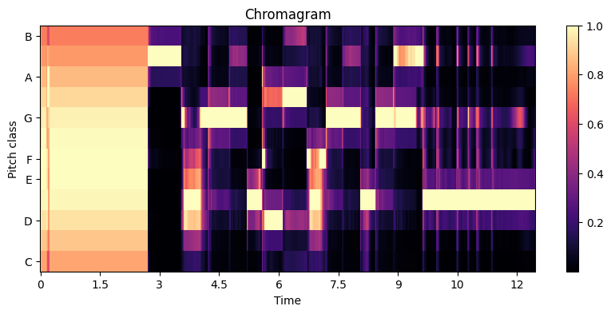

# Chopin Music Transformer 🎶

<p align="center">
  
  
  
  
</p>

## Project Overview

This project represents my deep dive into the exciting field of Music AI, a domain I'm incredibly passionate about. My primary motivation is to build a robust generative model for music, starting from foundational principles and incrementally adding complexity and sophistication. This repository showcases my initial steps in creating a deep learning model capable of generating original musical pieces in the distinct style of Frédéric Chopin's Nocturnes, as he is one of my favourite musicians.

Leveraging a **Transformer architecture**, this model learns intricate melodic, harmonic, and rhythmic patterns directly from symbolic music data. The goal is to produce musically coherent and stylistically authentic continuations from a given musical "seed," demonstrating the power of modern sequence modeling techniques in creative applications. This project serves as a tangible example of an AI-powered music generator, highlighting my ability to research, implement and adapt state-of-the-art neural networks.

## Features

* **Chopin Nocturne Style Generation:** The model is trained exclusively on a curated dataset of Chopin's Nocturnes, allowing it to capture the characteristic lyrical melodies, flowing accompaniments, and harmonic richness of the composer.
* **Custom Transformer Architecture:** Implements a custom Transformer Encoder model from scratch in PyTorch, showcasing proficiency in building and adapting state-of-the-art neural network architectures for generative tasks.
* **Autoregressive Generation with Causal Masking:** Employs a crucial causal (look-ahead) masking strategy within the Transformer's self-attention mechanism. This ensures that each generated token is predicted based only on preceding musical context, a fundamental requirement for coherent sequence generation.
* **Event-Based Music Representation:** Utilizes a detailed event-based tokenization scheme (`time_shift`, `note_on`, `note_off`) to represent musical nuances. This approach, inspired by **REMI (Recurrent Event-based MIDI Interleaving)**, converts continuous musical performance into a discrete sequence digestible by Transformer models.
* **Robust MIDI Processing Pipeline:** Includes custom Python scripts for efficient MIDI parsing, robust tokenization, and accurate conversion of generated token sequences back into playable MIDI files. This pipeline ensures data integrity and high-fidelity output.
* **Configurable Generation Parameters:** During inference, `temperature` and `top-k` (or `top-p` sampling, if implemented) parameters can be adjusted to fine-tune the creativity and coherence of the generated musical output.
* **Song End Token (`<EOS>`):** Incorporates a dedicated `song_end` token into the vocabulary, allowing the model to learn natural musical phrase and piece endings, preventing abrupt conclusions.
* **`librosa` for Analysis & Visualization:** Integration of `librosa` for potential audio analysis and visualization of musical data, aiding in understanding and evaluating generated results.

## Technical Details

### Architecture
The core of the music generation system is a custom **Transformer Encoder** model implemented in PyTorch. For generative tasks, this encoder behaves similarly to a decoder-only architecture due to the application of a causal mask. The latest architecture we have trained is as follows:

```python
class MusicTransformer(nn.Module):
    def __init__(self, vocab_size, d_model=256, nhead=4, num_layers=4):
        super().__init__()
        self.embedding = nn.Embedding(vocab_size, d_model)
        self.pos_encoder = nn.Parameter(torch.randn(1, 1000, d_model))
        encoder_layer = nn.TransformerEncoderLayer(d_model, nhead, 
        batch_first=True)
        self.transformer = nn.TransformerEncoder(encoder_layer, num_layers)
        self.output = nn.Linear(d_model, vocab_size)

    def forward(self, x):
        x = self.embedding(x) + self.pos_encoder[:, :x.size(1)]
        x = self.transformer(x, is_causal=True)
        return self.output(x)

```
- d_model (Model Dimension): 256 (current) - Controls the dimensionality of token embeddings and internal representations.

- nhead (Attention Heads): 4 (current) - Enables the model to attend to different aspects of the input simultaneously.

- num_layers (Encoder Layers): 4 (current) - Determines the depth of the Transformer for hierarchical feature extraction.

- Learnable Positional Encoding: Allows the model to learn optimal positional representations tailored to musical sequences.

- Causal Masking (is_causal=True): This critical feature in the TransformerEncoder's self-attention ensures that when the model generates a token, it only "sees" preceding tokens in the sequence. This is essential for autoregressive prediction, where each output depends solely on its history. While conceptually similar to a decoder in this generative context, it leverages the efficiency and commonality of PyTorch's TransformerEncoder while omitting the cross-attention component typically found in a full TransformerDecoder (which would be used for sequence-to-sequence tasks requiring attention to a separate input).

### Data Representation
- Music is represented as a sequence of discrete tokens, converted from MIDI data with a time_division of 0.05 seconds:

- time_shift_X: Represents a time delay of X * 0.05 seconds. The maximum X we have allowed is 500, allowing for pauses up to 25 seconds.

- note_on_PITCH: Indicates a note with a specific MIDI PITCH (21-108, covering the full piano range) being played.

- note_off_PITCH: Indicates a note with a specific MIDI PITCH being released.

- song_end: A special token appended to the end of each musical piece in the training data, signaling its conclusion.

### Training Details
- Dataset: All Chopin Nocturnes (excluding one held out for independent evaluation). The dataset is processed to provide a comprehensive representation of Chopin's compositional style.

- Input Sequence Length: 128 tokens for each training example.

- Batch Size: 128.

- Optimizer: Adam with an initial learning rate of 1e-4.

- Loss Function: nn.CrossEntropyLoss for next-token prediction, optimizing the model's ability to accurately predict the next musical event.

- Epochs: Currently undergoing training for an extended number of epochs to reach optimal performance. Initial training involved 5-10 epochs to establish a baseline.

## Current Status (Work-in-Progress)
This project is actively under development. We are currently training the model to learn the complex musical patterns within the Chopin Nocturne dataset. The current focus is on refining the model's training and dataset, as well as iterating on hyperparameter tuning to achieve higher quality musical generations. 

## Results & Evaluation
Librosa is utilized to generate a chromagram visualization of the generated MIDI output. This approach is particularly pertinent to this project because chromagrams abstract away octave information to reveal the underlying harmonic and melodic contours, which is a critical aspect of Chopin's rich, polyphonic compositions



Example: Piano roll visualization of a generated Chopin-esque phrase using librosa.

## Future Angles to Explore & Roadmap (TODO)
This project serves as a robust foundational step into Music AI, and I am committed to continuously improving its capabilities. Planned future enhancements and research directions include:

- **Relative Attention**
    - Implementing relative positional encoding instead of absolute encoding to better capture musical relationships independent of absolute position. This is key for handling varying musical structures. (Inspired by Music Transformer (Huang et al., 2019)).

- **Increased time_shift_0 Penalty**
    - Further fine-tuning the penalty applied to the time_shift_0 token during generation to encourage more temporal progression and avoid repetitive, static musical blocks, leading to more dynamic compositions.

- **Richer Event Representation & Expressivity**
    - Incorporating additional musical parameters such as velocity/dynamics and pedal events (sustain pedal on/off) into the token vocabulary. This will enable the model to generate more expressive and nuanced performances closer to human interpretations of Chopin. (Inspired by Oore et al., 2018, Yang et al., 2023).

- **Disentangled Control (Melody vs. Accompaniment)**
    - Exploring architectures or conditioning mechanisms that can disentangle and control distinct musical elements, such as the lyrical right-hand melody and the flowing left-hand accompaniment, which are hallmarks of Chopin's style. This could involve multi-track generation approaches.

- **Enhanced Training Dataset & Techniques**
    - Expanding the training dataset with more diverse Chopin performances (e.g., from MAESTRO dataset for expressive nuances) and exploring advanced training techniques like larger batch sizes, learning rate schedules, and gradient accumulation for more stable and effective learning.

- **Advanced Architectures**
    - Investigating more complex generative models such as Transformer-GANs for potentially more realistic and diverse outputs (Inspired by Donahue et al., 2019) or exploring Diffusion Models tailored for symbolic music, which have shown promising results in other generative domains.

- **Hierarchical Generation (Long-Term Structure)**
    - Implementing multi-level models to capture and generate long-term musical dependencies, allowing for the creation of entire pieces with cohesive emotional arcs and thematic development, moving beyond short phrases. (Inspired by MusicVAE (Roberts et al., 2018)).

- **Perceptual Loss**
    - Exploring loss functions that align more closely with human musical perception, potentially by integrating features from pre-trained music analysis models, to guide generation towards more aesthetically pleasing results that sound "right" to the human ear.
